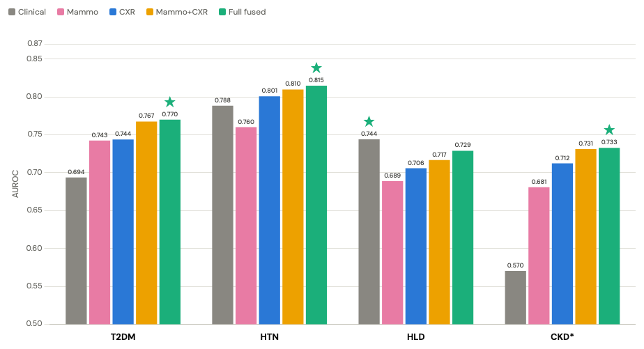
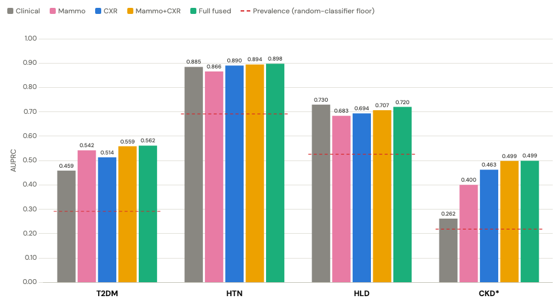

# Mammography + CXR risk subtyping

Does combining mammography and chest X-ray foundation-model embeddings predict clinical risk factors better than either modality alone? The outcomes are type 2 diabetes, hypertension, hyperlipidaemia and chronic kidney disease, all as prevalence at the time of imaging, and every comparison is reported by subgroup as well as overall. We find that fused embeddings opportunistically screen for Type 2 Diabetese and Chronic Kidney Disease better than either modality alone, even with a *two year gap* between images.

This repository is cleaned code from the HITI Lab's 2026 Datathon. The team: Aafi Mansuri, Meghana Reddy Dropathi, Benjamin Dixon, Behjat Riyaz, Leyla Warsame, Nikola Tanasijevic, Loyani Loyani, and InChan Hwang.

No patient data, imaging, or embeddings are included in this repository. See [`docs/data.md`](docs/data.md) for what the source cohort is, who can obtain it, and the input contract `cohort.py` expects.

## Results

AUROC and AUPRC by outcome and feature block, on the real cohort. `Full fused` is `clinical+mammo+cxr`, the block adjusted for demographics, race and acquisition covariates on top of both imaging modalities.





The fused block (★) wins on AUROC for every outcome except against hyperlipidemia (HLD), where demographics wins due to the inclusion of BMI, a direct correlate. Greatest gains in image fusion are in T2DM and CKD.

## Layout

```         
main.py                    Runs mammocxr.main:main
src/mammocxr/
  main.py                  builds the cohort, then fits linear.py + nonlinear.py over a grid
  cohort.py                raw stores (2 embedding dirs + 2 metadata csvs) -> modelling table
  simulate.py              CLI for common.simulate() -- writes a synthetic cohort parquet
  common.py                cohort structure and evaluation shared by both arms
  linear.py                arm 1: penalised logistic regression over feature blocks
  nonlinear.py             arms 2-4: early fusion, late fusion, gated wide-and-deep
  screen.py                label-free RankMe screen over the embedding blocks
  block_report.py          performance.csv + deltas.csv -> per-block table with a reading
  subgroup_reading.py      subgroups.csv -> per-subgroup accuracy table with a reading
```

The whole pipeline lives in`src/mammocxr/`, so every module is importable the same way regardless of directory. `uv sync` installs it in editable mode; every command below then runs either as a console script (`uv run mammocxr-linear ...`) or as `uv run python -m mammocxr.linear ...`. The root-level `main.py` is a two-line compatibility shim kept only so `uv run python main.py` still works.

`cohort.py` is the single data-loading pipeline, taking exactly two data locations, `--mammo-embed-dir` and `--cxr-embed-dir`, plus two small metadata csvs (`--cxr-meta`, `--cxr-icd`), and returns the block-prefixed modelling table(s) (`demo_`/`race_`/`tech_`/`mammo_`/`cxr_`) that `linear.py` and `nonlinear.py` read.

`common.py` holds the feature-group assignment, eligibility/restriction rules, metrics and the simulated-data fallback that both modelling arms need, so a delta between `linear.py` and `nonlinear.py` is attributable to architecture rather than data.

## Install

With [uv](https://docs.astral.sh/uv/):

```         
uv sync                      # numpy, pandas, scikit-learn, matplotlib, pyarrow, scipy
uv sync --extra nonlinear    # the above plus torch, needed only by nonlinear.py
```

`uv sync` also installs this repository itself, in editable mode, as the `mammocxr` package. `torch` is held behind an extra because it is a large download and only one of the four modelling arms uses it.

Without uv: `uv export --no-hashes > requirements.txt` from a machine that already has `uv.lock` resolved turns it into a plain `pip install -r requirements.txt` file.

## Run

`mammocxr` runs end-to-end. Without data locations it falls back to simulated data.

```         
uv run mammocxr --outdir results
```

With the real data, point it at the two embedding stores and the two metadata tables:

```         
uv run mammocxr \
    --mammo-embed-dir /path/to/mammo/embeddings \
    --cxr-embed-dir   /path/to/cxr/embeddings \
    --cxr-meta        /path/to/cxr_metadata.csv \
    --cxr-icd         /path/to/cxr_icd.csv \
    --outdir results
```

This writes `cohort_mammo.parquet` (and `cohort_fusion.parquet` unless `--mammo-only`) to `--outdir`, then fits the linear arm's blocks and the nonlinear arm's `--archs x --configs x --seeds` grid on the fusion table, writing every CSV both scripts would write on their own. `--skip-linear` / `--skip-nonlinear` narrow the run to one arm; `--outcomes`, `--blocks`, `--archs`, `--configs` and `--seeds` narrow the grid.

Each stage is also runnable on its own, as its own console script. To build only the cohort:

```         
uv run mammocxr-cohort \
    --mammo-embed-dir /path/to/mammo/embeddings --cxr-embed-dir /path/to/cxr/embeddings \
    --cxr-meta /path/to/cxr_metadata.csv --cxr-icd /path/to/cxr_icd.csv \
    --outdir .
```

to write a synthetic cohort in the same shape, for when a real one isn't available:

```         
uv run mammocxr-simulate --out cohort_simulated.parquet
```

and to fit one arm on an already-built table:

```         
uv run mammocxr-linear --cohort cohort_fusion.parquet --outdir results \
    --outcomes t2dm --blocks mammo cxr mammo+cxr --n-boot 50 --subgroup-boot 0
uv run mammocxr-nonlinear --cohort cohort_fusion.parquet --outdir results \
    --archs early --configs mammo+cxr --seeds 0
uv run mammocxr-block-report --indir results --out results/block_outcomes.csv
uv run mammocxr-subgroup-reading --infile results/subgroups.csv \
    --out results/subgroup_accuracy.csv
```

Any of the above also runs as `uv run python -m mammocxr.<module> ...` (e.g. `uv run python -m mammocxr.linear --help`) if you'd rather not use the console-script name.

The encoder screen takes any built table and ranks each embedding block by effective rank, using no labels:

```         
uv run mammocxr-screen --table cohort_fusion.parquet --out results/encoder_screen.csv
uv run mammocxr-screen --demo     # synthetic sanity check
```

## Conventions

Race and ethnicity are held out of the feature set by default (`--demographics age bmi`) and analysed post hoc as subgroup stratifiers: a model blind to race can still perform unequally across racial groups, which is what the subgroup tables measure. Subgroup levels below `--subgroup-min-n` (default 100) are counted but not scored.

Result tables and figures are written to `results/` and are not tracked.

See [`docs/methods.md`](docs/methods.md) for the cohort definition, the nested cross-validation design, every metric reported, what `--clinical-scale` does and why, and a statement of what is and is not reproducible across runs and hardware. See [`docs/outputs.md`](docs/outputs.md) for a column-by-column reference to every output CSV.

## Timeline (Datathon 2026)

At the time of submission at Datathon 2026, the following features were complete:

- Complete pipeline for cohort selection

- Architectures: early fusion Elastic Net Logistic Regression / early fusion MLP / late fusion MLP / gated MLP

- Automatic embedding model selection using RankMe

- Subgroup analyses (age, race, BMI, imaging year, and imaging interval)

- Fairness assessments

- Data visualizations

The current repository is a cleaned and summarized collection of this work (unifying cohort aggregation into a single script, cleaner code refactor). Any future commits are post-hoc methodological additions intended to further analysis and bug fixes.